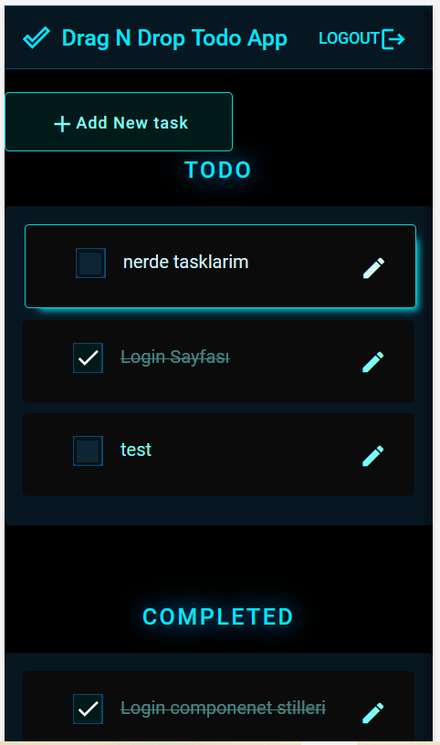
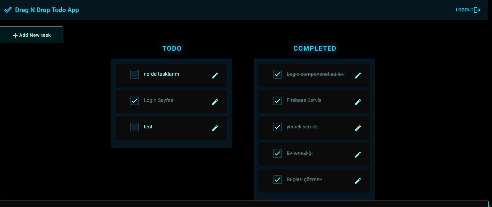
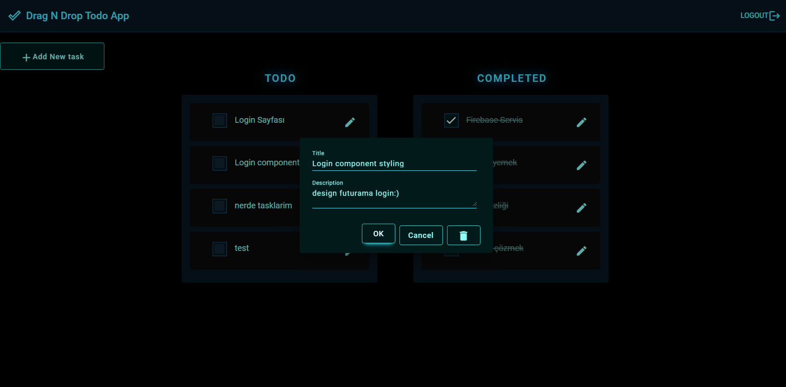

# DragDropTodo

Draggable Kanban task app

### Screenshots

<figure>
<figcaption>Mobile</figcaption>

</figure>

<figure>
<figcaption>Desktop</figcaption>

</figure>
<figure>
<figcaption>Dialog Active States</figcaption>

</figure>
Stack
-----
- Angular CLI 11.0.4.
- Firebase
- RxJS
- Material UI

## Quick Start

#### Install Angular CLI

```shell
$ npm install -g @angular/cli
```

#### Clone the app, install package dependencies, and start the dev server @ `localhost:4200`

```shell
$ git clone https://github.com/definite2/angular-todo-app.git
$ cd angular-todo-app
$ npm install
$ npm start
```

## Deploying to Firebase

#### Prerequisites

- Create a free Firebase account at https://firebase.google.com
- Create a project from your [Firebase account console](https://console.firebase.google.com)
- Configure the authentication providers for your Firebase project from your Firebase account console

#### Configure this app with your project-specific details

Edit `.firebaserc` in the project root:

```json
{
  "projects": {
    "default": "your-project-id"
  }
}
```

Edit the firebase configuration in `src/environment.ts`

```typescript
...
firebaseConfig : {
  apiKey: 'your api key',
  authDomain: 'your-project-id.firebaseapp.com',
  databaseURL: 'https://your-project-id.firebaseio.com',
  storageBucket: 'your-project-id.appspot.com'
}
```

#### Install firebase-tools

```shell
$ npm install -g firebase-tools
```

#### Build and deploy the app

```shell
$ npm run build
$ firebase login
$ firebase deploy --project zyour-projectID>
```

## Development server

Run `ng serve` for a dev server. Navigate to `http://localhost:4200/`. The app will automatically reload if you change any of the source files.

## Code scaffolding

Run `ng generate component component-name` to generate a new component. You can also use `ng generate directive|pipe|service|class|guard|interface|enum|module`.

## Build

Run `ng build` to build the project. The build artifacts will be stored in the `dist/` directory. Use the `--prod` flag for a production build.

## Running unit tests

Run `ng test` to execute the unit tests via [Karma](https://karma-runner.github.io).

## Running end-to-end tests

Run `ng e2e` to execute the end-to-end tests via [Protractor](http://www.protractortest.org/).

## Further help

To get more help on the Angular CLI use `ng help` or go check out the [Angular CLI Overview and Command Reference](https://angular.io/cli) page.
